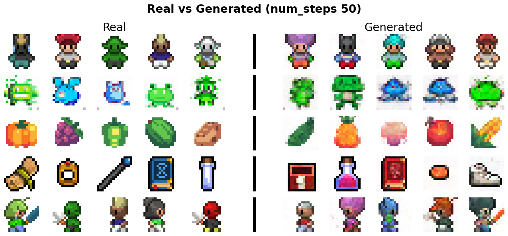
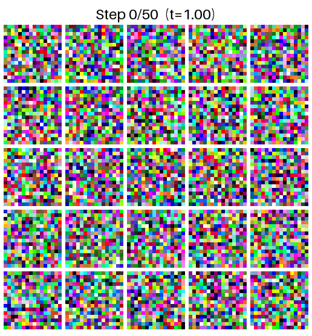
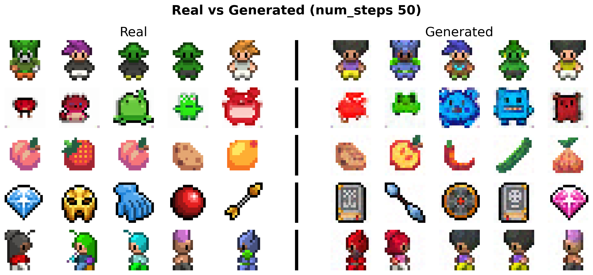
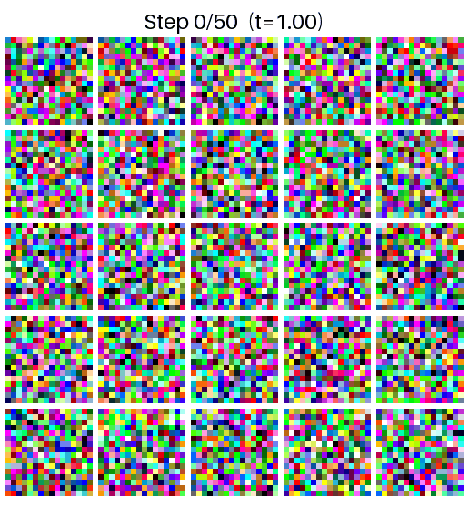
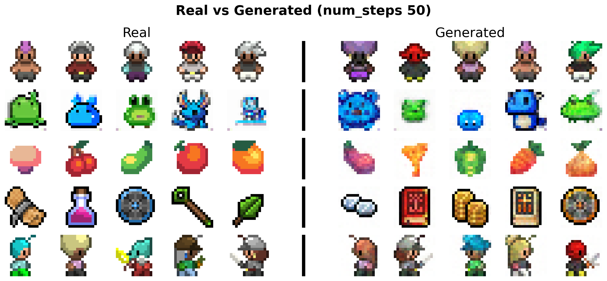
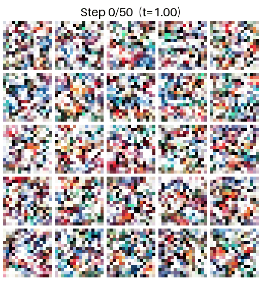
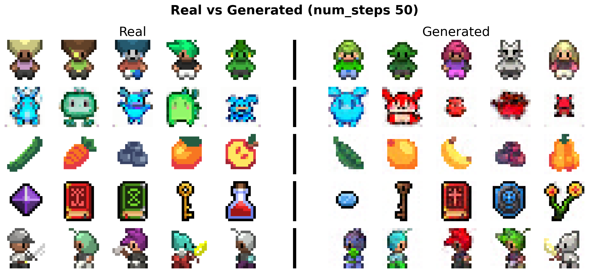
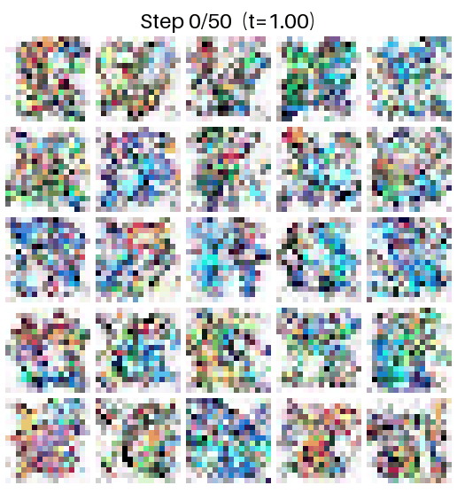
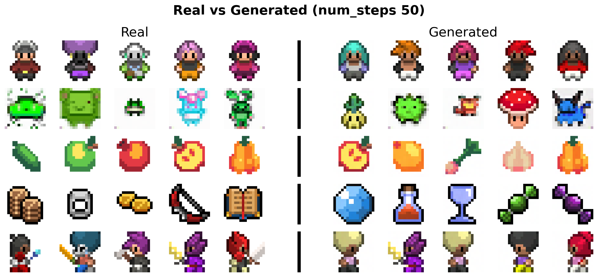
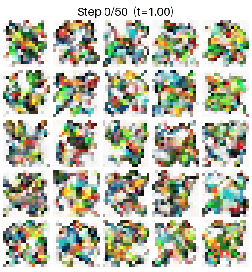

# Flow-Matching-Pytorch
Let's build an lightweight generative model using the “Flow Matching” algorithm. Our goal is perfect reconstruction, and we'll see how well it restores fine details through the denoising process. We use a pixel art dataset (shape: 3x16x16).  
  
There are currently five versions available. You can view them as ipynb files, and pre-trained pth files can be downloaded from the Releases.  

- Flow Matching Basic
- Flow Matching Enhanced
- Latent Flow Matching
- Latent Flow Matching + VQ-VAE
- Latent Flow Matching Enhanced

  

## Flow Matching Basic 
### Result

### Denoising

Good, but the slight pixel differences and rendering are disappointing. 
  
 

## Flow Matching Enhanced
The Enhanced version incorporates the following improvements over the previous version:  
- Exponential Moving Average (EMA)  
- Classifier Free Guidance (CFG)  
- Logit Normal Sampling (Sigmoid)  
- Max Pooling -> Strided Convolutions
  
### Result

### Denoising

 

## Latent Flow Matching  
Instead of working in pixel space, we pre-train a VAE and apply Flow Matching in its latent space ((3, 16, 16) -> (8, 4, 4)). The UNet predicts velocity fields over compact latent vectors rather than raw pixels, making training more efficient while capturing higher-level structure.  
  
   

### Result  
  

### Denoising

  
   

## Latent Flow Matching + VQ-VAE  
We replace the continuous VAE with a discrete VQ-VAE. Since the codebook vectors are continuous in R^D, Flow Matching still applies. We train on pre-quantization outputs (z_e) for smooth gradients, then re-quantize before decoding.  

 
  
### Result

### Denoising

   

## Latent Flow Matching Enhanced
To improve reconstruction quality, we expanded the latent space from (8, 4, 4) to (16, 4, 4), added ResBlock and Self-Attention modules, and used MSE + L1 loss. The UNet was also improved. 

   

### Result  
  

### Denoising

